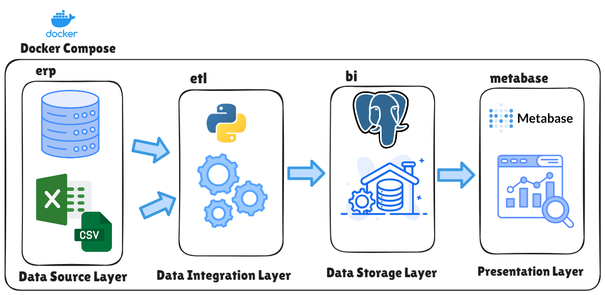
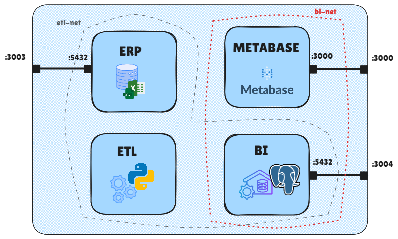
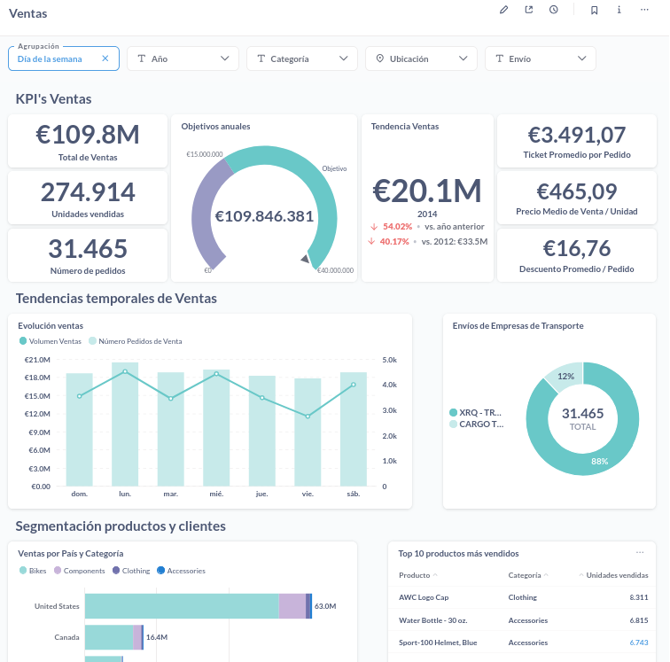

# ClearBI:  Analítica de Datos para Business Intelligence

Este proyecto forma parte del Trabajo Fin de Ciclo de Desarrollo de Aplicaciones Multiplataforma. Implementa un sistema completo de integración, almacenamiento y análisis de datos para una empresa ficticia dedicada a la venta de bicicletas y accesorios.

---

## 📊 Descripción

El sistema automatiza la extracción, transformación y carga (ETL) de datos provenientes de un ERP, almacena los datos en un **Data Warehouse** en modelo estrella y facilita su análisis mediante la herramienta de visualización **Metabase**.

---

## 🛠️ Arquitectura

- **ERP:** Base de datos operativa con datos normalizados.
- **Data Warehouse BI:** Base de datos desnormalizada para análisis.
- **ETL:** Proceso automatizado de carga de datos.
- **Metabase:** Plataforma para consultas y visualización de datos.

Los servicios están orquestados mediante **Docker Compose** y organizados en redes internas para mayor seguridad.

[](img/arquitectura.png)


Los servicios se comunican mediante dos redes internas:
- **etl-net**: Comunicación entre ERP, DWH y ETL
- **bi-net**: Comunicación entre DWH y Metabase

[](img/redes.png)

---

## 📝 Estructura del Proyecto

```
.
├── erp/
│   ├── Dockerfile
│   ├── init-erp.sh
│   └── backup.dump
├── bi/
│   ├── Dockerfile
│   ├── init-bi.sh
│   └── schema-bi.sql
├── etl/
│   ├── Dockerfile
│   ├── etl.py
│   ├── schema-bi.sql
│   └── requirements.txt
├── img/
│   ├── arquitectura.png
│   ├── despliegue.png
├── metabase/
│   ├── Dockerfile
│   └── wait-for-etl.sh
├── docker-compose.yml
├── .env.example
└── Makefile
```

---

## 📚 Requisitos

- Docker & Docker Compose
- Make (opcional, recomendado)
- Python 3.12+ 

---

## 🔧 Configuración

1. Copiar el archivo `.env.example` a `.env` y configurar las variables.
2. Asegurarse de que los puertos **3000**, **3003** y **3004** estén disponibles.

---

## 🚀 Primer despliegue (Build Inicial)

Antes de iniciar por primera vez, es necesario construir las imágenes de Docker:

```bash
make build
make up
```

Esto creará las imágenes, restaurará la base de datos operativa y preparará el entorno completo para su ejecución.

---

## 🔄 Ejecución diaria (Reload de datos)

Para actualizar los datos diariamente, ejecuta el proceso ETL:

```bash
make all
```
---

## 📈 Proceso ETL

El proceso ETL realiza las siguientes acciones:

1. Espera que las bases de datos estén disponibles.
2. Elimina y recrea la base de datos **bi**.
3. Carga el esquema estrella desde `schema-bi.sql`.
4. Extrae, transforma y carga datos desde el ERP al DWH.
5. Crea la tabla de control `etl_ready`.

**Monitorizar proceso ETL**: `tail -f etl/etl.log`

---

## 🌐 Acceso a Metabase

Una vez iniciado el sistema, puedes acceder a la herramienta de visualización:

- URL: [http://localhost:3000](http://localhost:3000)
- Usuario y contraseña: configurados en el archivo `.env`

La conexión al DWH está preconfigurada para facilitar la creación de cuadros de mando y consultas.

[](img/ventas-sin-filtros.png)
---

## 📚 Licencia

Proyecto desarrollado exclusivamente con fines educativos para el Trabajo Fin de Ciclo.

